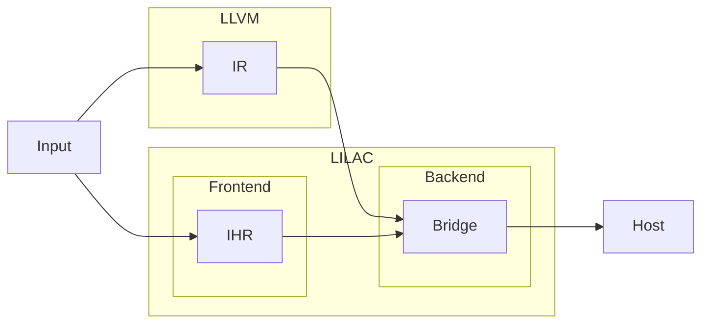
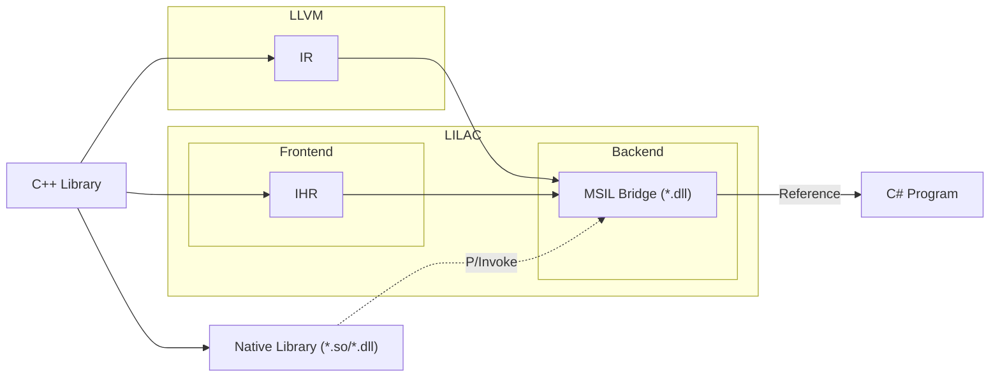

# Welcome to LILAC

> [!IMPORTANT]
> ***WORKING IN PROGRESS***

*LILAC* is a **L**LVM based **I**nteroperability **LA**yer **C**ompiler -
with a goal that producing bindings across languages.

Interoperability across languages always sucks developers...
(Especially, For managed languages such as Java, C#, Python)

For example, between C++ and C#:

- C++/CLI couldn't support modern C++ well
- P/Invoke couldn't support C++ well because of name mangling etc.

But, with power of LLVM, we hope that LILAC will generate bindings between C++ and C# ...or what else!

**Let's break down language barrier!**

## Infrastructure

LILAC Infrastructure consists of
LLVM IR (Intermediate Representation) and 
LILAC IHR (Intermediate Hierarchy Representation)

For example:

