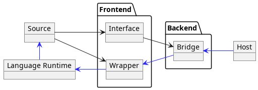
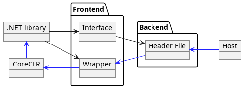
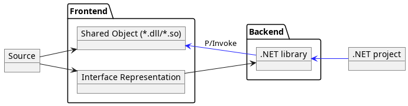
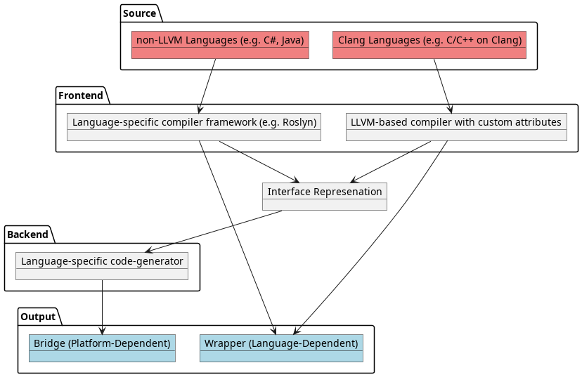
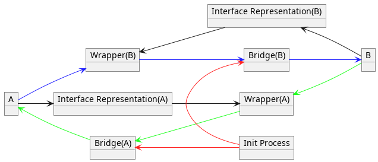

# Infrastructure Spec

## Summary

- *Black line represents compile path*
- *Blue line represents runtime call-path*

### Compile Path

1. Compile interface representation from source (*.jar for Java, *.dll for C#, etc...)
2. Generate bridge from interface representation

### Call Path

1. Host calls bridge
2. Bridge calls wrapper stub
3. Wrapper calls language-specific runtime
4. Runtime calls source

### Exempli gratia

For example (Use C# on C++):

However, Native languages (such as C++) doesn't have language-specific runtime:

## Compilation Process

- Additional attributes describing Object-Oriented information (such as 'which class owns this function') required
  - That's because LLVM IR does not support OOP model

## Bidirectional Linkage

- *Black line represents compile path*
- *Blue/Green line represents runtime call-path*
- *Red line represents runtime load-path(such as `dlopen` or `LoadLibrary`)*

With this model, each language can be linked on one process(`Init Process` in this diagram).
